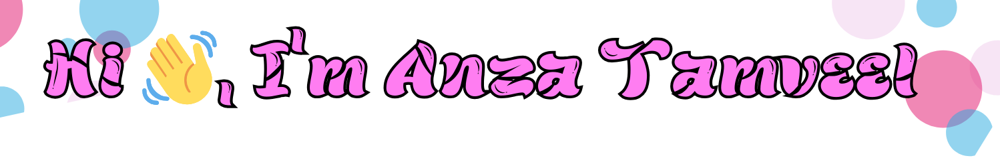

<h3 align="center" style="font-family:verdana"><b>A Passionate Computer Science Student</b>
</h3>

  

- 🔭 I’m currently working on **Console Base Game and Application.**

- 🌱 I’m currently learning **C++ and HTML.**

- 👯 I’m looking to collaborate on **GDSC.**

- 💬 Ask me about **C++.**

- 📫 How to reach me **anzatamveel@gmail.com**

<h3 align="left">Connect with me:</h3>

<h3 align="left">Languages and Tools:</h3>

          

